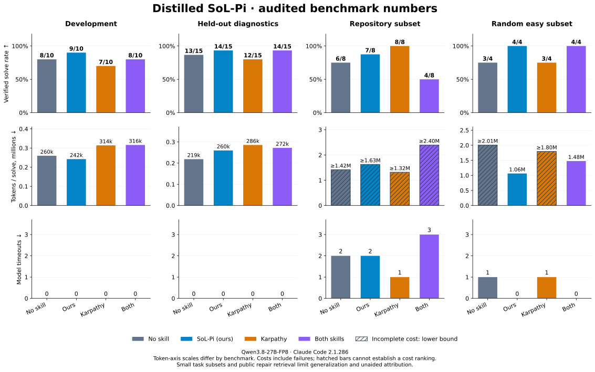

# Distilled SoL-Pi

**Read less. Reuse evidence. Verify the fix.**

A portable `efficient-coding` skill inspired by [NVlabs/SoL-Pi](https://github.com/NVlabs/SoL-Pi), designed to reduce repeated reads and avoidable tool turns. Includes reproducible comparisons against no skill and Karpathy guidelines.

## Numbers

**LLM:** Qwen3.8-27B-FP8 · **Runtime:** SGLang + DFlash · **Agent:** Claude Code 2.1.286.



[PNG download](assets/benchmark-numbers.png) · [Reproduce the plot](scripts/plot_numbers.py). Hatched cost bars are incomplete lower bounds; token-axis scales differ by benchmark.

| Benchmark | Configuration | Solves ↑ | Tokens / solve ↓ | Timeouts ↓ |
|---|---|---:|---:|---:|
| Development | No skill (baseline) | 8/10 | 260k | 0 |
| Development | SoL-Pi (ours) | 9/10 | 242k | 0 |
| Development | Karpathy | 7/10 | 314k | 0 |
| Development | Both skills | 8/10 | 316k | 0 |
| Held-out diagnostics | No skill (baseline) | 13/15 | 219k | 0 |
| Held-out diagnostics | SoL-Pi (ours) | 14/15 | 260k | 0 |
| Held-out diagnostics | Karpathy | 12/15 | 286k | 0 |
| Held-out diagnostics | Both skills | 14/15 | 272k | 0 |
| Repository subset | No skill (baseline) | 6/8 | ≥1.42M | 2 |
| Repository subset | SoL-Pi (ours) | 7/8 | ≥1.63M | 2 |
| Repository subset | Karpathy | 8/8 | ≥1.32M | 1 |
| Repository subset | Both skills | 4/8 | ≥2.40M | 3 |
| Random easy subset | No skill (baseline) | 3/4 | ≥2.01M | 1 |
| Random easy subset | SoL-Pi (ours) | 4/4 | 1.06M | 0 |
| Random easy subset | Karpathy | 3/4 | ≥1.80M | 1 |
| Random easy subset | Both skills | 4/4 | 1.48M | 0 |

**Ours** is the latest shipped revision. **Both skills** loads Karpathy and ours separately. Tokens include failed attempts; `k` = thousand, `M` = million, `≥` = incomplete lower bound. Unmeasured or unverified items are marked **TBD**.

Ours leads on the new random easy subset, but baseline is cheaper on held-out diagnostics. **A stable general efficiency win is not established.** Public repair retrieval limits repository attribution; incomplete costs do not support exact savings claims.

Five diagnostic cases ×2 development / ×3 held-out rounds; four repository issues ×2 rounds; two new randomly selected easy issues ×2 rounds. The campaigns stay separate. Scheduling seeds do not control model sampling. [Full results and limitations](report.md) · [Random subset details](eval/random-followup/results/summary.md).

<details>
<summary>Original-version results</summary>

The original entrypoint was 6,573 bytes; ours is the 2,584-byte revision. These earlier measurements use different tasks and Claude Code 2.1.285 and are not pooled above.

| Benchmark | Configuration | Solves ↑ | Tokens / solve ↓ |
|---|---|---:|---:|
| Stress suite | No skill | 15/15 | 194k |
| Stress suite | Original SoL-Pi (ours) | 15/15 | 209k |
| Stress suite | Karpathy | 15/15 | 226k |
| Stress suite | Both skills, original ours | 15/15 | 244k |
| Repository repairs | No skill | 19/24 | 2.40M |
| Repository repairs | Original SoL-Pi (ours) | 19/24 | 2.55M |
| Repository repairs | Karpathy | 19/24 | 2.30M |
| Repository repairs | Both skills, original ours | 19/24 | 2.39M |

The later development candidate was rejected and is not shipped. Original calibration and smoke comparisons are in the full report.

</details>

## Quick start

Inside Claude Code:

```text
/plugin marketplace add reliable-era/distill-skill-nvlabs-SoL-Pi
/plugin install distill-sol-pi@sol-pi-skills
/distill-sol-pi:efficient-coding Fix the failing parser test and verify the change.
```

For another task:

```text
Use efficient-coding to investigate logs/test-run.log, check the failure
against the source, fix it, and run the affected tests.
```

## Install for your agent

### Claude Code marketplace

Use the commands above. The repository supplies the [marketplace and plugin manifests](.claude-plugin/). Installation is tested in Docker and GitHub Actions.

### Skills CLI — Claude Code, Codex, Cursor

**Repository-specific installation validation: TBD.** The commands below follow the Skills CLI documentation; these client installation paths have not been tested here.

Using the [open Skills CLI](https://github.com/vercel-labs/skills), choose your client:

```bash
# Claude Code
npx skills add reliable-era/distill-skill-nvlabs-SoL-Pi --skill efficient-coding --agent claude-code

# Codex
npx skills add reliable-era/distill-skill-nvlabs-SoL-Pi --skill efficient-coding --agent codex

# Cursor
npx skills add reliable-era/distill-skill-nvlabs-SoL-Pi --skill efficient-coding --agent cursor
```

These commands target this GitHub repository. Official marketplace listing: **TBD**. Performance on Codex/Cursor and other LLM backends: **TBD**. Add `--global` for a user-wide installation. In Codex, invoke with `$efficient-coding`.

### Manual project installation

```bash
gh repo clone reliable-era/distill-skill-nvlabs-SoL-Pi
cd distill-skill-nvlabs-SoL-Pi
TARGET_PROJECT=/absolute/path/to/your/project
mkdir -p "$TARGET_PROJECT/.claude/skills"
cp -R skills/efficient-coding "$TARGET_PROJECT/.claude/skills/"
```

Copy the whole directory; references and helpers are part of the skill. Back up any existing installation before replacing it. A [ZIP distribution](.claude/skills/efficient-coding.zip) is also available.

## How it works

Focused source reads, bounded log inspection, exact evidence checks, recovery from rejected tool arguments, and relevant verification. On resumption, reconcile continuation notes with current files before repeating work.

This is instruction-level guidance. It does not implement upstream Pi's native context replacement, fused tools, or compaction. Supporting resources are optional; routine fixes need no extra bookkeeping or agents. [Read the skill](skills/efficient-coding/SKILL.md).

## Validate an upgrade

```bash
docker build -f validation/Dockerfile -t sol-pi-validation .
docker run --rm --network none sol-pi-validation
```

The [GitHub workflow](.github/workflows/validate.yml) checks manifests, installs the plugin in a fresh non-root container, verifies installed resource bytes, and checks helper entrypoints. No model calls are made; performance upgrades need separate behavioral evaluation.

## Evidence and contributions

[Full report](report.md) · [147-attempt audit](eval/pruned/audit/independent-final147-audit.json) · [16-attempt follow-up audit](eval/random-followup/audit/independent-final16.json) · [Comparison CSV](eval/pruned/results/comparison.csv) · [Issue templates](https://github.com/reliable-era/distill-skill-nvlabs-SoL-Pi/issues/new/choose).

Benchmark code, frozen inputs, grades, and traces live in `eval/`. Runtime dependencies and the downloaded Claude Code binary are excluded; manifests retain their hashes. Historical paths identify the original execution workspace.
